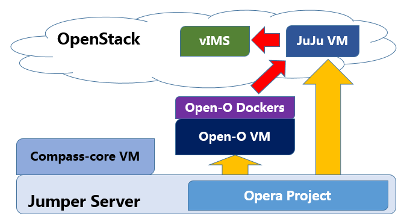
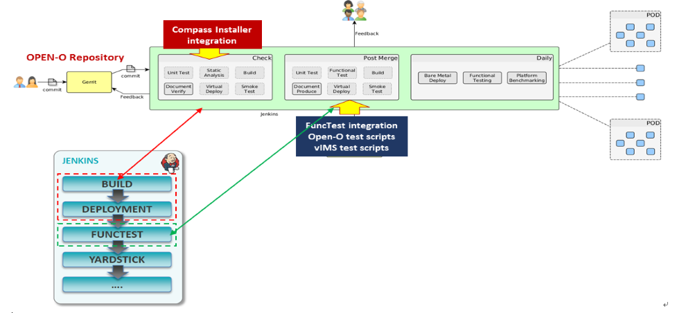
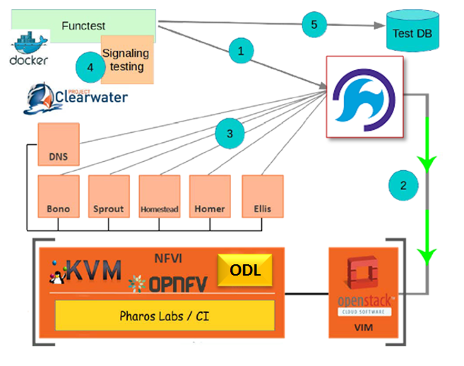
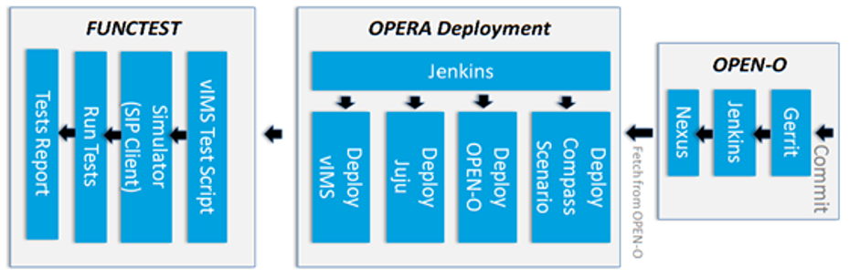

.. This work is licensed under a Creative Commons Attribution 4.0 International License.
.. http://creativecommons.org/licenses/by/4.0
.. (c) by Yingjun Li (HUAWEI) and Harry Huang (HUAWEI)

OPERA Requirement and Design
============================

- Define Scenario OS-NOSDN-OPENO-HA and Integrate OPEN-O M Release
  with OPNFV D Release (with OpenStack Newton)
- Integrate OPEN-O to OPNFV CI Process
   + Integrate automatic Open-O and Juju installation
- Deploy Clearwater vIMS through OPEN-O
   + Test case to simulate SIP clients voice call
- Integrate vIMS test scripts to FuncTest

OS-NOSDN-OPENO-HA Scenario Definition
=====================================

Compass4NFV supports Open-O NFV Scenario
----------------------------------------
- Scenario name: os-nosdn-openo-ha
- Deployment: OpenStack + Open-O + JuJu
- Setups:
   + Virtual deployment (one physical server as Jump Server with
     OS ubuntu)
   + Physical Deployment (one physical server as Jump Server,
     ubuntu + 5 physical Host Server)

    Fig 1. Deploy Overview

Open-O is participating OPNFV CI Process
========================================

- All steps are linked to OPNFV CI Process
- Jenkins jobs remotely access OPEN-O NEXUS repository to fetch binaries
- COMPASS is to deploy scenario based on OpenStack Newton release.
- OPEN-O and JuJu installation scripts will be triggered in Jenkins job
  after COMPASS finish deploying OpenStack
- Clearwater vIMS deploy scripts will be integrated into FuncTest
- Clearwater vIMS test scripts will be integrated into FuncTest

    Fig 2. Opera Ci

The vIMS is used as initial use case
====================================

based on which test cases will be created and aligned with Open-O first
release for OPNFV D release.

- Creatting scenario (os-nosdn-openoe-ha) to integrate Open-O with OpenStack Newton.
- Integrating with COMPASS as installer, FuncTest as testing framework
- Clearwater vIMS is used as VNFs, Juju is used as VNFM.
- Use Open-O as Orchestrator to deploy vIMS to do end-2-end test with the following steps.

1.  deploy Open-O as orchestrator
2.  create tenant by Open-O to OpenStack
3.  deploy vIMS VNFs from orchestrator based on TOSCA blueprintn and create VNFs
4.  launch test suite
5.  collect results and clean up

    Fig 3. vIMS Deploy

Requirement and Tasks
=====================

OPERA Deployment Key idea
-------------------------

- Keep OPEN-O deployment agnostic from an installer perspective (Apex, Compass, Fuel, Joid)
- Breakdown deployments in single scripts (isolation)
- Have OPNFV CI Process (Jenkins) control and monitor the execution

Tasks need to be done for OPNFV CD process
------------------------------------------

1.  Compass to deploy scenario of os-nosdn-openo-noha
2.  Automate OPEN-O installation (deployment) process
3.  Automate JuJu installation process
4.  Create vIMS TOSCA blueprint (for vIMS deployment)
5.  Automate vIMS package deployment (need helper/OPEN-O M)
     - (a)Jenkins to invoke OPEN-O Restful API to import & deploy vIMS ackage
6.  Integrate scripts of step 2,3,4,5 with OPNFV CD Jenkins Job

FUNCTEST
--------

1.  test case automation
     - (a)Invoke URL request to vIMS services to test deployment is successfully done.
2.  Integrate test scripts with FuncTest
     - (a)trigger these test scripts
     - (b)record test result to DB

    Fig 4. Functest

