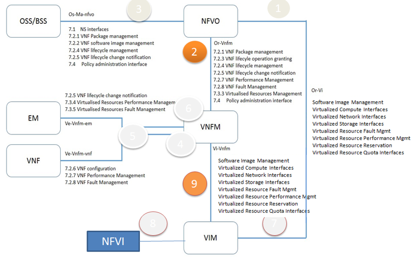
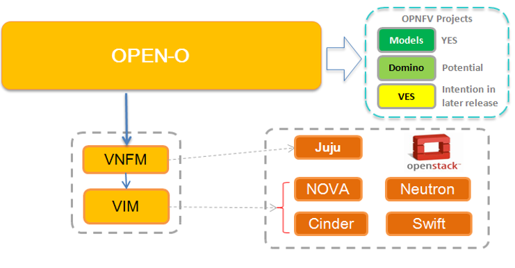
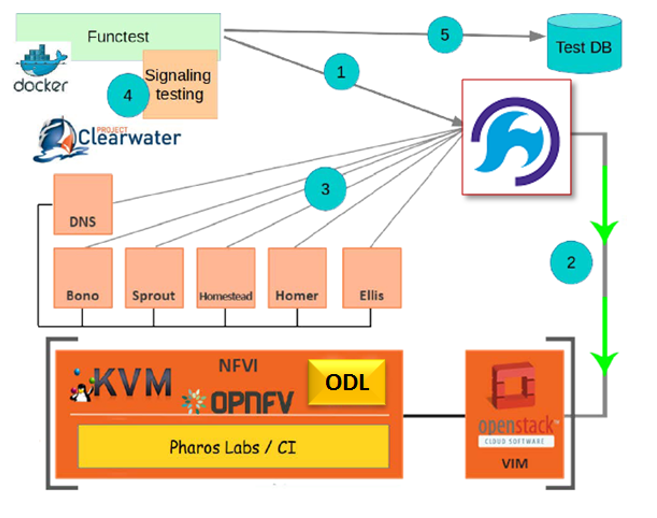

.. This work is licensed under a Creative Commons Attribution 4.0 International License.
.. http://creativecommons.org/licenses/by/4.0
.. (c) by Yingjun Li (HUAWEI) and Harry Huang (HUAWEI)

OPERA Project Overview
======================

Since OPNFV board expanded its scope to include NFV MANO last year,
several upstream open source projects have been created to develop
MANO solutions. Each solution has demonstrated its unique value in
specific area. Open-Orchestrator (OPEN-O) project is one of such
communities. Opera seeks to develop requirements for OPEN-O MANO
support in the OPNFV reference platform, with the plan to eventually
integrate OPEN-O in OPNFV as a non-exclusive upstream MANO. The
project will definitely benefit not only OPNFV and Open-O, but can
be referenced by other MANO integration as well. In particular, this
project is basically use case driven. Based on that, it will focus
on the requirement of interfaces/data models for integration among
various components and OPNFV platform. The requirement is designed
to support integration among Open-O as NFVO with Juju as VNFM and
OpenStack as VIM.

Currently OPNFV has already included upstream OpenStack as VIM, and
Juju and Tacker have been being considered as gVNFM by different OPNFV
projects. OPEN-O as NFVO part of MANO will interact with OpenStack and
Juju. The key items required for the integration can be described as
follows.

    Fig 1. Key Item for Integration

Open-O is scoped for the integration
====================================

OPEN-O includes various components for OPNFV MANO integration. The initial
release of integration will be focusing on NFV-O, Common service and Common
TOSCA. Other components of Open-O will be gradually integrated to OPNFV
reference platform in later release.

    Fig 2. Deploy Overview

The vIMS is used as initial use case
====================================

based on which test cases will be created and aligned with Open-O first
release for OPNFV D release.

- Creatting scenario (os-nosdn-openoe-ha) to integrate Open-O with OpenStack Newton.
- Integrating with COMPASS as installer, FuncTest as testing framework
- Clearwater vIMS is used as VNFs, Juju is used as VNFM.
- Use Open-O as Orchestrator to deploy vIMS to do end-2-end test with the following steps.

1.  deploy Open-O as orchestrator
2.  create tenant by Open-O to OpenStack
3.  deploy vIMS VNFs from orchestrator based on TOSCA blueprintn and create VNFs
4.  launch test suite
5.  collect results and clean up

    Fig 3. vIMS Deploy

